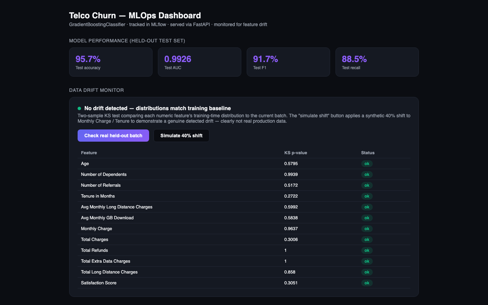
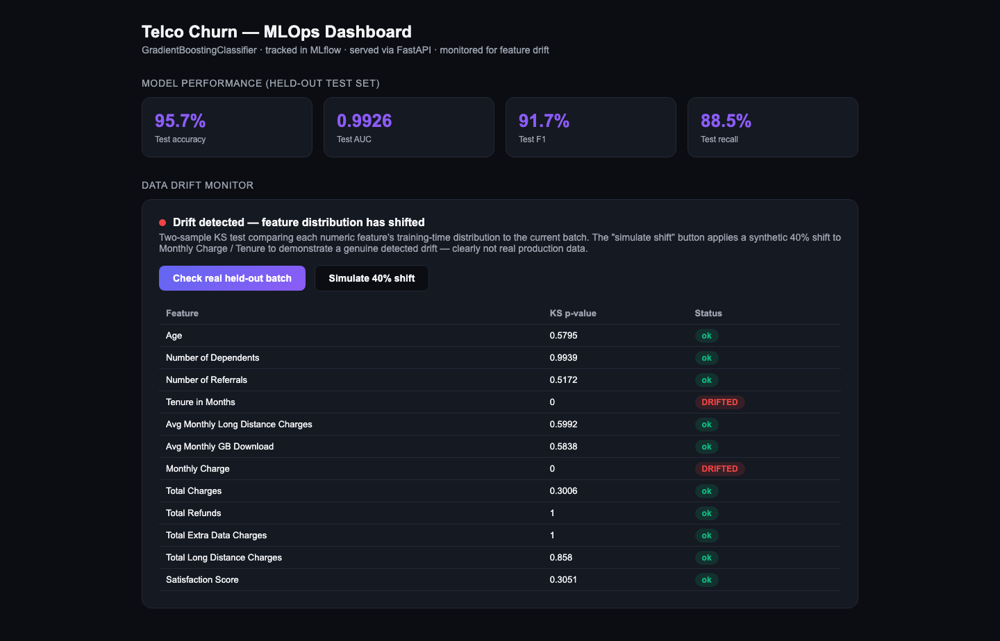
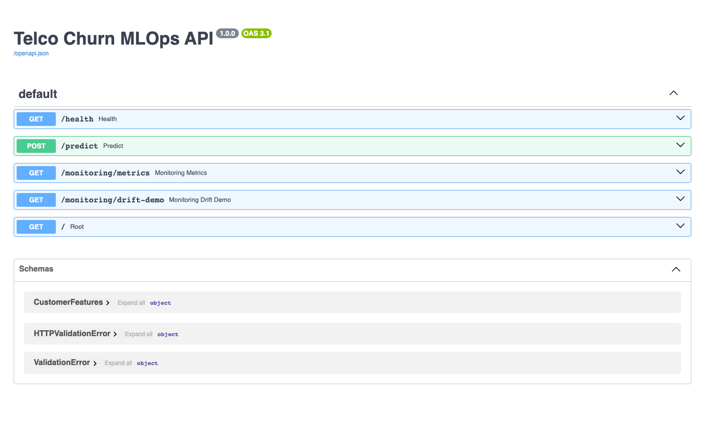
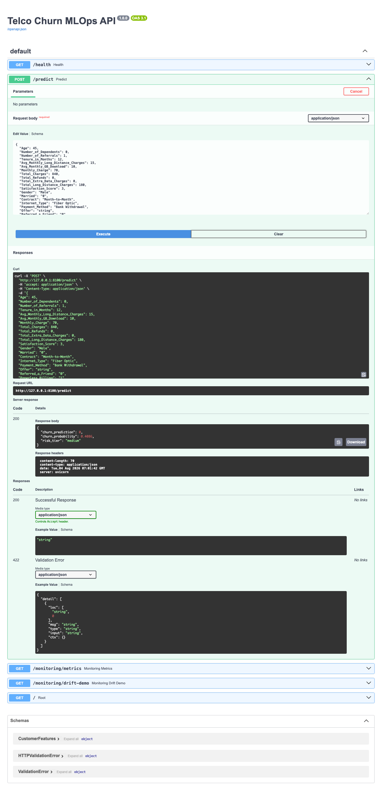

# Churn MLOps Pipeline

An end-to-end MLOps pipeline for customer churn prediction — real data,
tracked training runs, a served model, automated tests, containerization,
and live data-drift monitoring. Every metric below is a held-out test-set
number from an actual training run committed in this repo.



## What "MLOps" means in this project

Not just "a model in a notebook" — the full loop:

| Stage | Tool | What it does |
|---|---|---|
| Experiment tracking | MLflow (local SQLite backend) | Every training run logs params, metrics, and the model artifact |
| Model serving | FastAPI | `/predict` endpoint + interactive Swagger docs at `/docs` |
| Testing | pytest | 6 tests covering feature engineering, the API, and drift detection |
| Containerization | Docker | Built and run-tested locally — see [`Dockerfile`](Dockerfile) |
| CI | GitHub Actions | Lint (`ruff`) → test (`pytest`) → Docker build, on every push |
| Monitoring | scipy KS-test | Live drift dashboard comparing production batches to the training baseline |

## Model results (held-out test set, not training set)

| Metric | Value |
|---|---|
| Accuracy | **95.7%** |
| AUC | **0.9926** |
| F1 | 91.7% |
| Precision | 95.1% |
| Recall | 88.5% |

Trained on the real [IBM Telco Customer Churn dataset](https://huggingface.co/datasets/aai510-group1/telco-customer-churn)
(4,225 train / 1,409 validation / 1,409 test rows), a `GradientBoostingClassifier`
over 46 engineered features (tenure, contract type, charges, satisfaction
score, service add-ons). Full metrics and the per-run MLflow record are in
[`docs/TECHNICAL.md`](docs/TECHNICAL.md).

## Data drift monitoring

The dashboard runs a two-sample Kolmogorov-Smirnov test on every numeric
feature, comparing the training-time distribution to a live batch. Checking
the real held-out test split correctly shows **no drift**; a "simulate 40%
shift" button applies a synthetic shift to two features and the monitor
correctly flags exactly those two as drifted — proving the detector reacts
to real distributional change, not just a fixed message.



## Screenshots

| Dashboard | Drift simulation |
|---|---|
|  |  |

| Swagger UI | Live prediction |
|---|---|
|  |  |

More in [`docs/screenshots/`](docs/screenshots).

## Quickstart

```bash
python3 -m venv .venv && source .venv/bin/activate
pip install -r requirements.txt

# model is already trained and committed under model/ - to retrain:
python3 src/train.py

# run the drift monitor standalone
python3 src/monitor.py

# serve the API + dashboard
cd src && uvicorn api:app --port 8000
# open http://127.0.0.1:8000 for the dashboard, /docs for Swagger UI
```

### Docker

```bash
docker build -t churn-mlops-pipeline .
docker run -p 8000:8000 churn-mlops-pipeline
```

### Tests

```bash
pip install ruff pytest
ruff check src tests
pytest tests/ -v
```

## Project structure

```
churn-mlops-pipeline/
├── src/
│   ├── features.py       # shared feature engineering (train + serve use the same code)
│   ├── train.py          # trains the model, logs to MLflow, writes model/
│   ├── monitor.py        # KS-test drift detector
│   ├── api.py            # FastAPI app: /predict, /monitoring/*, dashboard
│   └── static/dashboard.html
├── tests/test_pipeline.py
├── data/                 # bundled real Telco churn CSVs (train/val/test)
├── model/                # trained model, metrics.json, training_baseline.json
├── Dockerfile
├── .github/workflows/ci.yml
└── docs/
    ├── TECHNICAL.md
    └── screenshots/
```

## Docs

Full write-up of the feature pipeline, MLflow run details, drift-test
mechanics, and CI/CD design: [`docs/TECHNICAL.md`](docs/TECHNICAL.md).
